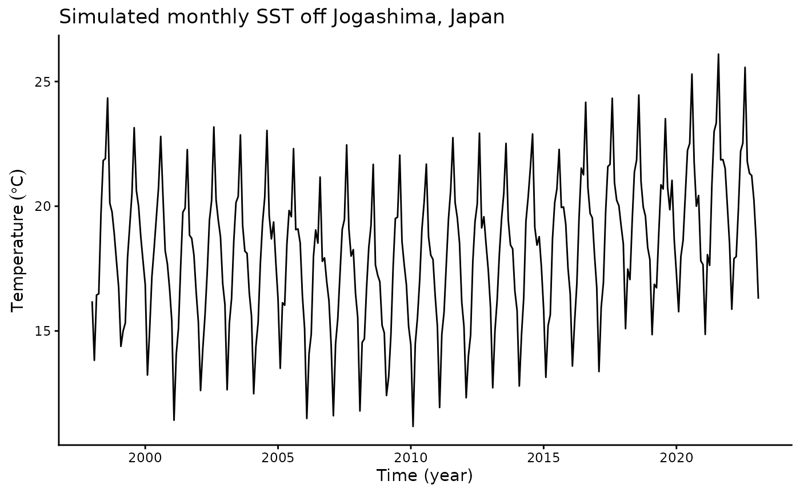
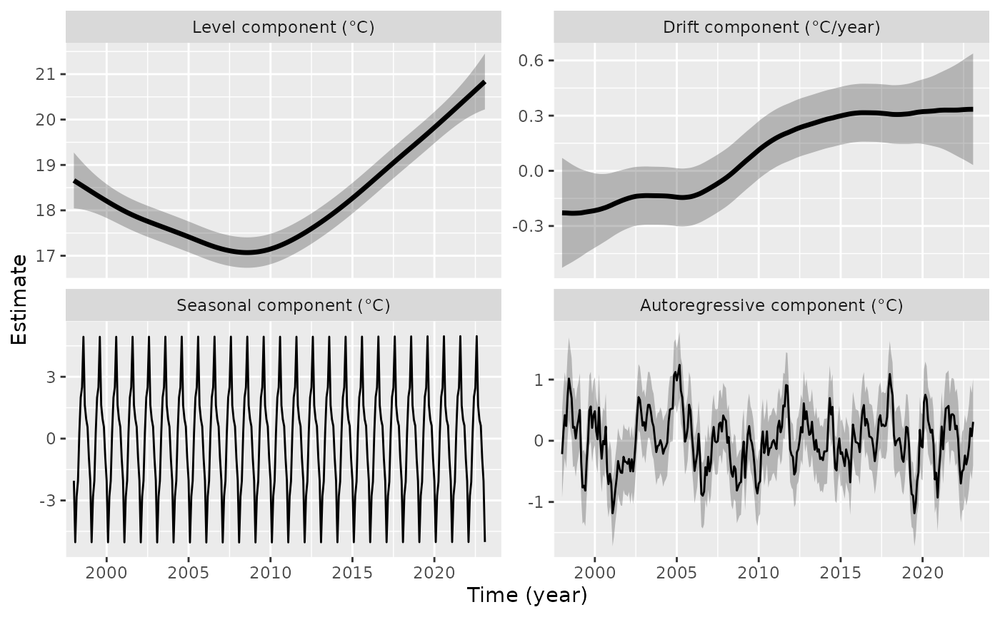
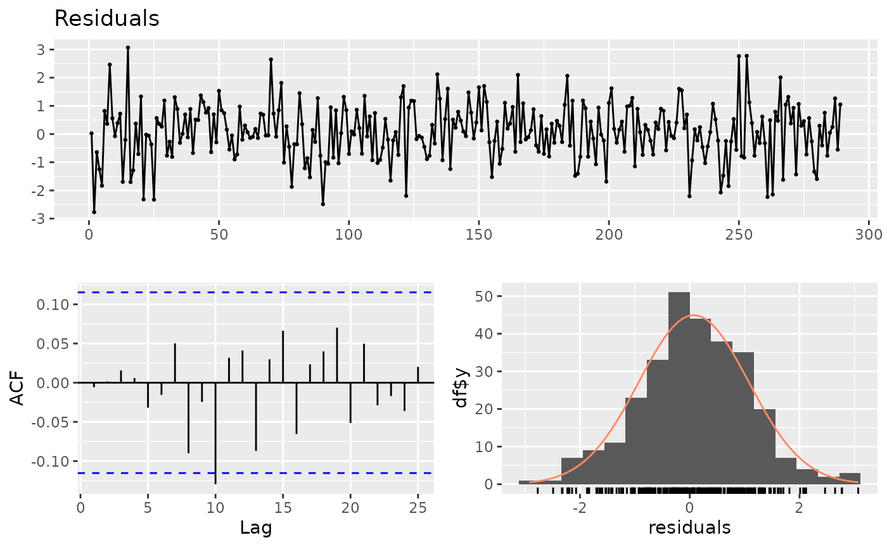

# tempssm: State-space modeling for temperature time series in R

## Summary

`tempssm` is an R package for state-space modeling of environmental
temperature time series, including air and water temperature
observations. It provides a practical framework for assessing how
long-term trend, seasonal variation, autoregressive dependence, and
optional exogenous effects contribute to observed temporal variation.
The package facilitates the application of linear Gaussian state-space
models estimated by Kalman filtering and smoothing, using the `KFAS`
package as the computational backend (Helske, 2017).

## Key Features

- Designed for environmental temperature time series with arbitrary
  seasonal frequencies; currently validated primarily on monthly data
- Estimates latent states using linear Gaussian state-space models
  combined with Kalman filtering and smoothing
- Models temperature dynamics as a sum of interpretable latent
  components, including long-term trend, seasonal variation,
  autoregressive dependence, and optional exogenous effects
- Allows users to specify an arbitrary order of the autoregressive
  component (default: AR(1))
- Implements time-series cross-validation for model evaluation

## Input Data Format

The core modeling functions in `tempssm` expect input time series to be
supplied as R `ts` objects. The `ts` class is base R’s standard format
for regularly spaced time series (see the
[`stats::ts`](https://rdrr.io/r/stats/ts.html) documentation:
<https://search.r-project.org/R/refmans/stats/html/ts.html>). The
package also provides utility functions for converting common tabular
and observational data formats into `ts` objects before model fitting.

## Prior Art and Scope

`tempssm` provides a domain-focused workflow for analyzing temperature
time series with linear Gaussian state-space models. It brings together
model construction, component extraction, uncertainty summaries,
residual diagnostics, visualization, and time-series cross-validation in
a single R package interface tailored to temperature applications.

The package builds on established statistical methodology, including
linear Gaussian state-space modeling, Kalman filtering, and Kalman
smoothing. Model estimation is handled through the `KFAS` package, which
provides a general framework for state-space models in R.

The initial implementation was adapted from the supplementary code
provided by Baba (2024), accompanying Baba et al. (2024), which analyzed
sea temperature trends using a linear Gaussian state-space model. The
supplementary code is publicly available at:

<https://github.com/logics-of-blue/sea-temperature-trend-jogashima>

Compared with that prior implementation, `tempssm` extends the workflow
into a reusable R package interface with input validation, documented S3
methods, tests, diagnostics, cross-validation utilities, and examples
for broader temperature time-series analysis.

The next section gives a brief model overview. A separate model
specification vignette describes the mathematical formulation in more
detail.

## Model Overview

`tempssm` represents temperature variation with a linear Gaussian
state-space model composed of interpretable latent components: a
long-term trend, seasonal variation, autoregressive dependence, and
optional exogenous effects. The model is estimated with `KFAS`, and
[`tempssm()`](https://akihirao.github.io/tempssm/reference/tempssm.md)
returns both filtering and smoothing estimates. Unless otherwise stated,
the summaries, diagnostics, and plots in this vignette use smoothed
state estimates.

The full mathematical specification, including the observation equation,
state decomposition, seasonal constraint, autoregressive component,
exogenous component, parameter count, and estimation procedure, is
described in the separate model specification document, available as a
PDF in the package repository:

<https://github.com/akihirao/tempssm/blob/main/vignettes/model-specification.pdf>

## Setup

Load `tempssm` before running the examples below.

``` r

## Set libraries
library(tempssm)
```

The objective of this practice is to demonstrate the basic application
of a linear Gaussian state-space model to a univariate temperature time
series. This example introduces the basic workflow for fitting a
`tempssm` model, inspecting the summary output, plotting latent
components, checking residual diagnostics, and making short-term
predictions.

## Example Dataset

A sample sea surface temperature (SST) dataset is included in the
package.

- **Dataset**: Simulated monthly sea surface temperature (SST) off
  Jogashima, Miura City, Kanagawa Prefecture, Japan
- **Format**: Univariate `ts` object
- **Frequency**: 12 (monthly)
- **Unit**: Degrees Celsius
- **Period**: January 1998 to February 2023

This dataset is a simulated monthly SST time series based on the
state-space model analysis of sea temperature off Jogashima reported by
Baba et al. (2024). It is distributed with the supplementary materials
and prototype code for the motivating study:

<https://github.com/logics-of-blue/sea-temperature-trend-jogashima>

``` r

data(sst_jogashima) # load a ts object of SST off Jogashima
head(sst_jogashima)
```

    ##        Jan   Feb   Mar   Apr   May   Jun
    ## 1998 16.19 13.82 16.44 16.49 19.70 21.83

``` r

summary(sst_jogashima)
```

    ##       Temp      
    ##  Min.   :11.17  
    ##  1st Qu.:16.22  
    ##  Median :18.39  
    ##  Mean   :18.23  
    ##  3rd Qu.:20.11  
    ##  Max.   :26.10

This simulated dataset contains no missing observations. In general,
[`tempssm()`](https://akihirao.github.io/tempssm/reference/tempssm.md)
can retain missing values in the response temperature series and treat
them as unobserved responses during Kalman filtering and smoothing.

## Plot the Time Series

We begin by visualizing the monthly SST time series to examine its
overall structure, including apparent trends, seasonal variability, and
whether missing observations are present.

``` r

plt_jogashima_sst <- forecast::autoplot(sst_jogashima) +
  ggplot2::labs(
    y = expression(Temperature ~ (degree * C)),
    x = "Time (year)"
  ) +
  ggplot2::ggtitle("Simulated monthly SST off Jogashima, Japan") +
  ggplot2::theme_classic()

plot(plt_jogashima_sst)
```



The overall mean SST is approximately 18.2 °C, and a clear seasonal
pattern is visible. The series contains no missing observations. SST
appears to decline gradually from the beginning of the series to around
2010 and then increase thereafter. However, year-to-year variability is
also evident, making it difficult to identify a clear long-term pattern
from the raw time series alone.

## Fit a State-Space Model

When a `ts` object containing temperature time-series data (here,
`sst_jogashima`) is passed to the core function
[`tempssm()`](https://akihirao.github.io/tempssm/reference/tempssm.md),
model construction and parameter estimation are performed together. The
returned S3 object of class `tempssm` (here, `res`) stores the filtering
and smoothing estimates, as well as the constructed model and input
data. By default,
[`tempssm()`](https://akihirao.github.io/tempssm/reference/tempssm.md)
fits a first-order autoregressive model.

``` r

# model with first-order autoregressive component
res <- tempssm(sst_jogashima) # AR(1), the default model
summary(res)
```

    ## tempssm summary
    ## -----------------
    ## Call:
    ## tempssm(temp_data = sst_jogashima)
    ## 
    ## Model fit:
    ##   Likelihood type: marginal 
    ##   Log-likelihood : -198.19 
    ##   k              : 5 
    ##   Diffuse states : 13 
    ##   Converged      : TRUE 
    ## 
    ## Variance parameters:
    ##   Observation (H): 0.07496414 
    ##   State (Q trend): 4.937125e-06 
    ##   State (Q season): 0.0001763537 
    ##   State (Q ar): 0.1202156 
    ## 
    ## Components of auto-regression:
    ##   Order of AR: 1 
    ##   Coefficient of AR1: 0.7579371

First, confirm from the summary output that the model has converged
(`Converged: TRUE`). The summary also reports the log-likelihood,
parameter count (`k`), likelihood type, and number of diffuse initial
states. The estimated parameters include the observation error variance
(`H`) and the process error variances for the long-term trend
(`Q trend`), seasonal component (`Q season`), and autoregressive
component (`Q ar`), as well as the autoregressive coefficient (`AR1` in
the default model). See the detailed manual for extracting and using
these quantities directly; its location is listed at the end of this
quick tutorial.

## Plot Model Components

We visualize the estimated long-term evolution of temperature levels and
their rates of change (drift) by extracting the corresponding latent
components from the state-space model. Additionally, seasonal
variability and autoregressive dependence are plotted out, allowing the
underlying trend behavior to be examined more clearly.

``` r

# plot all components at once
plot(res)
```



The level component suggests a long-term pattern that changes around
2008: the underlying SST level decreases during the first part of the
series and then increases during the latter part. The drift component
shows a corresponding pattern, with mostly negative values before around
2008 and positive values thereafter. The seasonal component captures the
recurring annual cycle, while the autoregressive component represents
shorter-term departures from the trend and seasonal pattern. The shaded
gray areas represent 95% confidence intervals for the estimated latent
states, illustrating the uncertainty associated with each estimated
component. Because this is a simulated dataset, these component plots
should be interpreted as an illustration of the model output rather than
as direct estimates from the original observational record.

The standard plotting interface is `plot(res)`. The explicit helper
`plot_tempssm_components(res)` produces the same component plot and can
be useful in scripts where a descriptive function name is preferred. The
ggplot2-style S3 interface `ggplot2::autoplot(res)` is also available.
These interfaces return a faceted `ggplot` object, so selected
components can be stored and customized with standard ggplot2 layers,
for example,
`plot_tempssm_components(res, component = c("level", "drift")) + ggplot2::theme_bw()`.

## Check Residual Diagnostics

The package provides diagnostic tools for checking whether the fitted
model has left notable structure in the residuals. In particular,
residual time-series plots, residual autocorrelation, residual
distributions, and Ljung-Box tests can be used to assess remaining
temporal dependence and departures from the Gaussian error assumption.

``` r

r <- get_tempssm_residuals(res)
lb_lag <- frequency(res$temp_data)
forecast::checkresiduals(r, lag = lb_lag, test = "LB")
```



    ## 
    ##  Ljung-Box test
    ## 
    ## data:  Residuals
    ## Q* = 9.6827, df = 12, p-value = 0.6438
    ## 
    ## Model df: 0.   Total lags used: 12

Here,
[`get_tempssm_residuals()`](https://akihirao.github.io/tempssm/reference/get_tempssm_residuals.md)
explicitly extracts the standardized recursive residuals from the fitted
model.
[`forecast::checkresiduals()`](https://pkg.robjhyndman.com/forecast/reference/checkresiduals.html)
then displays the residual time series, residual autocorrelation plot
(ACF plot), and residual frequency distribution, together with a
Ljung-Box test. The lag is set to the seasonal frequency of the input
data; for monthly data, this uses lag 12. These plots and the test
result should be checked for any notable residual patterns. In this
example, the Ljung-Box test indicated no significant residual
autocorrelation up to lag 12 (P \> 0.05).

For tabular residual diagnostic summaries, see
[`diagnose_residuals()`](https://akihirao.github.io/tempssm/reference/diagnose_residuals.md)
in the detailed manual.

For repeated checks across many fitted models, the convenience wrapper
`plot_tempssm_residual_diagnostics(res)` provides the same type of
residual diagnostic plot.

## Extract Components

The long-term trend component and its rate of change (drift) can be
extracted as ts objects as follows.

``` r

# Smoothing estimates
alpha_hat <- res$kfs$alphahat
head(alpha_hat)
```

    ##             level       slope sea_dummy1 sea_dummy2 sea_dummy3 sea_dummy4
    ## Jan 1998 18.65840 -0.01905354 -2.0428374 -0.9196344  0.5642451  0.9553991
    ## Feb 1998 18.63934 -0.01906722 -5.0256252 -2.0428374 -0.9196344  0.5642451
    ## Mar 1998 18.62028 -0.01909100 -2.8244535 -5.0256252 -2.0428374 -0.9196344
    ## Apr 1998 18.60118 -0.01911004 -2.0508949 -2.8244535 -5.0256252 -2.0428374
    ## May 1998 18.58207 -0.01914416  0.2882283 -2.0508949 -2.8244535 -5.0256252
    ## Jun 1998 18.56293 -0.01918604  1.9925949  0.2882283 -2.0508949 -2.8244535
    ##          sea_dummy5 sea_dummy6 sea_dummy7 sea_dummy8 sea_dummy9 sea_dummy10
    ## Jan 1998  1.6282639  4.9410126  2.4937014  1.9925949  0.2882283  -2.0508949
    ## Feb 1998  0.9553991  1.6282639  4.9410126  2.4937014  1.9925949   0.2882283
    ## Mar 1998  0.5642451  0.9553991  1.6282639  4.9410126  2.4937014   1.9925949
    ## Apr 1998 -0.9196344  0.5642451  0.9553991  1.6282639  4.9410126   2.4937014
    ## May 1998 -2.0428374 -0.9196344  0.5642451  0.9553991  1.6282639   4.9410126
    ## Jun 1998 -5.0256252 -2.0428374 -0.9196344  0.5642451  0.9553991   1.6282639
    ##          sea_dummy11     arima1
    ## Jan 1998  -2.8244535 -0.2178663
    ## Feb 1998  -2.0508949  0.1519894
    ## Mar 1998   0.2882283  0.4187224
    ## Apr 1998   1.9925949  0.2408083
    ## May 1998   2.4937014  0.7185730
    ## Jun 1998   4.9410126  1.0167731

``` r

# 　Smoothing estimate of level component
level_ts <- get_level_ts(res)

# 　Smoothing estimate of drift component
drift_ts <- get_drift_ts(res)

# Average drift rate per year across the full period
mean_drift_year <- mean(drift_ts)
mean_drift_year
```

    ## [1] 0.08777083

Average annual increase in SST is approximately 0.09 °C.

## Make Short-Term Predictions

A fitted `tempssm` object can also be passed to
[`predict()`](https://rdrr.io/r/stats/predict.html) to obtain short-term
predictions. By default, `predict(res)` returns a one-step-ahead
prediction beyond the end of the observed series. This is useful for
visual checks of how the fitted model extrapolates the estimated level,
seasonal, and autoregressive components.

``` r

pred_1 <- predict(res)
pred_1
```

    ##           Mar
    ## 2023 18.33035

Predictions for multiple future time points can be requested by setting
the `n.ahead` argument.

``` r

pred_12 <- predict(res, n.ahead = 12)
pred_12
```

    ##           Jan      Feb      Mar      Apr      May      Jun      Jul      Aug
    ## 2023                   18.33035 18.96985 21.33710 23.08522 23.51856 26.03694
    ## 2024 19.09319 16.16926                                                      
    ##           Sep      Oct      Nov      Dec
    ## 2023 22.69098 22.00902 21.74806 20.19190
    ## 2024

These predictions should be interpreted as model-based extrapolations
rather than definitive forecasts. Uncertainty generally increases as the
prediction horizon becomes longer, and long-horizon predictions can be
sensitive to model assumptions about trend, seasonality, and
autoregressive dependence.

## Further Reading

The examples above illustrate the basic univariate workflow for fitting,
diagnosing, visualizing, and making short-term predictions from a
`tempssm` model. The detailed manual extends this workflow to exogenous
variables, additional model diagnostics, and time-series
cross-validation:

<https://github.com/akihirao/tempssm/blob/main/tools/manual/tempssm_manual.pdf>
