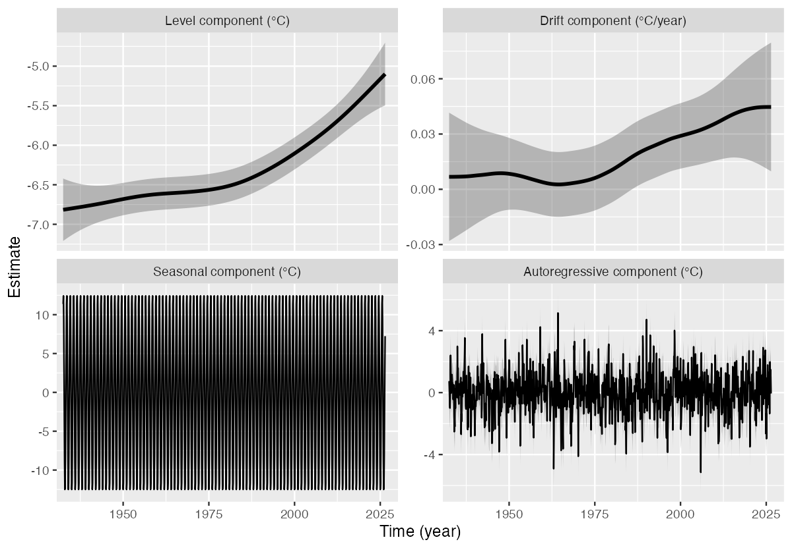

# tempssm

`tempssm` is an R package for state-space modeling of environmental
temperature time series, including air and water temperature
observations. It provides a practical framework for assessing how
long-term trend, seasonal variation, autoregressive dependence, and
optional exogenous effects contribute to observed temporal variation.
The package facilitates the application of linear Gaussian state-space
models estimated by Kalman filtering and smoothing, using the `KFAS`
package as the computational backend (Helske, 2017).

## Key Features

- Fits linear Gaussian state-space models to environmental temperature
  time series.
- Represents temperature dynamics using interpretable latent components:
  long-term trend, seasonal variation, autoregressive dependence, and
  optional exogenous effects.
- Supports arbitrary seasonal frequencies, while the current examples
  and validation focus primarily on monthly temperature data.
- Allows users to specify an arbitrary order of the autoregressive
  component (default: AR(1)).
- Includes time-series cross-validation tools for model evaluation.

## Input Data Format

R `ts` objects are the primary input format for `tempssm`. The
temperature series passed to
[`tempssm()`](https://akihirao.github.io/tempssm/reference/tempssm.md)
should be supplied as a univariate `ts` object, and optional exogenous
variables can be supplied as univariate or multivariate `ts` objects.
The `ts` class is base R’s standard format for regularly spaced time
series (see the [`stats::ts`](https://rdrr.io/r/stats/ts.html)
documentation:
<https://search.r-project.org/R/refmans/stats/html/ts.html>). Utility
functions are included to help convert common tabular or observational
data into `ts` objects before fitting.

The seasonal cycle used by
[`tempssm()`](https://akihirao.github.io/tempssm/reference/tempssm.md)
is taken from the `frequency` attribute of the input `ts` object. For
example, `frequency = 12` represents monthly data.

## Prior Art and Scope

`tempssm` provides a domain-focused workflow for analyzing temperature
time series with linear Gaussian state-space models. It brings together
model construction, component extraction, uncertainty summaries,
residual diagnostics, visualization, and time-series cross-validation in
a single R package interface tailored to temperature applications.

The model can be viewed as an extension of a basic structural
time-series model, in which the observed temperature series is
decomposed into latent components such as a long-term trend, seasonal
variation, autoregressive dependence, and optional exogenous effects.
The mathematical formulation is described in the model specification
vignette linked below.

The package builds on established statistical methodology, including
linear Gaussian state-space modeling, Kalman filtering, and Kalman
smoothing. Model estimation is handled through the `KFAS` package, which
provides a general framework for state-space models in R.

Several other R packages support plotting, time-series handling, data
input, and examples. In particular, `ggplot2` is used for package
plotting methods, `zoo` for selected time-series conversion utilities,
and `forecast` in tutorial examples for basic time-series visualization.

The initial implementation was adapted from the supplementary code
provided by Baba (2024), accompanying Baba et al. (2024), which analyzed
sea temperature trends using a linear Gaussian state-space model. The
supplementary code is publicly available at:

<https://github.com/logics-of-blue/sea-temperature-trend-jogashima>

Compared with that prior implementation, `tempssm` extends the workflow
into a reusable R package interface with input validation, documented S3
methods, tests, diagnostics, cross-validation utilities, and examples
for broader temperature time-series analysis.

## Installation

``` r

# Install from Github
# install.packages("pak")
pak::pak("akihirao/tempssm")

# Alternative
# install.packages("devtools")
devtools::install_github("akihirao/tempssm")
```

## Documentation

A short tutorial is available in the package vignette:

<https://github.com/akihirao/tempssm/blob/main/vignettes/getting-started.pdf>

The model specification is described separately:

<https://github.com/akihirao/tempssm/blob/main/vignettes/model-specification.pdf>

A comprehensive reference manual (English) is available on the package
site:

<https://akihirao.github.io/tempssm/articles/tempssm_manual.html>

For Japanese users, a detailed manual is also provided on the package
site:

<https://akihirao.github.io/tempssm/articles/tempssm_manual_jp.html>

## Basic Usage

### Load the Package and Example Data

This example uses `sst_niigata`, a monthly sea surface temperature (SST)
time series off Niigata, Japan, covering 2002 to 2023. The series is
provided as a `ts` object and can be passed directly to
[`tempssm()`](https://akihirao.github.io/tempssm/reference/tempssm.md).

``` r

library(tempssm)
data(sst_niigata)
```

### Fit a State-Space Model

The function
[`tempssm()`](https://akihirao.github.io/tempssm/reference/tempssm.md)
fits a linear Gaussian state-space model to a temperature time series.

``` r

res <- tempssm(sst_niigata)
```

The returned object is an S3 object of class `"tempssm"`. Results can be
inspected with standard methods.

``` r

summary(res)
plot(res)
```



Example output from plot(res)

The panels show the level component (long-term trend; upper left), drift
component (rate of change in the long-term trend; upper right), seasonal
component (lower left), and autoregressive component (lower right). The
gray ribbons indicate pointwise 95% confidence intervals.

In this example, the estimated level component suggests a gradual
long-term increase in SST. The seasonal component captures the recurring
annual cycle, while the autoregressive component represents shorter-term
departures from the trend and seasonal pattern.

For scripted workflows,
[`plot_tempssm_components()`](https://akihirao.github.io/tempssm/reference/plot_tempssm_components.md)
returns the same component plot as a `ggplot` object;
[`ggplot2::autoplot()`](https://ggplot2.tidyverse.org/reference/autoplot.html)
is also available.

### Use Your Own Data

For monthly temperature data stored in a CSV file, prepare columns named
`Year`, `Month`, and `Temp`. Use `NA` for missing temperature values,
and keep the corresponding `Year` and `Month` entries.

``` text
Year,Month,Temp
2010,8,13.6
2010,9,6.8
2010,10,NA
2010,11,-1.4
...
```

The CSV file should be comma-separated and UTF-8 encoded. An example CSV
file is included with the package.

``` r

path <- system.file(
  "extdata",
  "example_monthly_temp.csv",
  package = "tempssm"
)

temp_ts <- tempssm::read_monthly_temp_ts(path)
res_csv <- tempssm(temp_ts)
```

The helper function
[`read_monthly_temp_ts()`](https://akihirao.github.io/tempssm/reference/read_monthly_temp_ts.md)
reads this type of CSV file and converts it into an R `ts` object for
use with
[`tempssm()`](https://akihirao.github.io/tempssm/reference/tempssm.md).
If your data are already stored as a `ts` object, you can pass them
directly to
[`tempssm()`](https://akihirao.github.io/tempssm/reference/tempssm.md).

## References

Baba, S. (2024). Supplementary code and test data for estimating sea
temperature trends using a linear Gaussian state-space model. GitHub
repository:
<https://github.com/logics-of-blue/sea-temperature-trend-jogashima>

Baba, S., Ishii, H., and Yoshiyama, T. (2024). Estimating sea
temperature trends using a linear Gaussian state-space model in
Jogashima, Kanagawa, Japan. *Bulletin of the Japanese Society of
Fisheries Oceanography*, 88(3), 190-199. (In Japanese with an English
abstract.) <https://doi.org/10.34423/jsfo.88.3_190>

Helske, J. (2017). KFAS: Exponential family state space models in R.
*Journal of Statistical Software*, 78(10), 1-39.
<https://doi.org/10.18637/jss.v078.i10>
