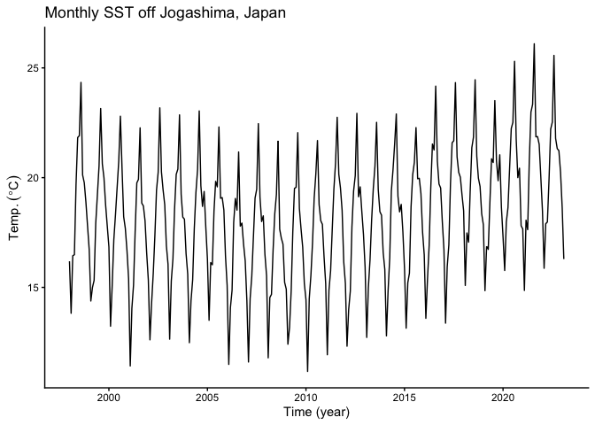
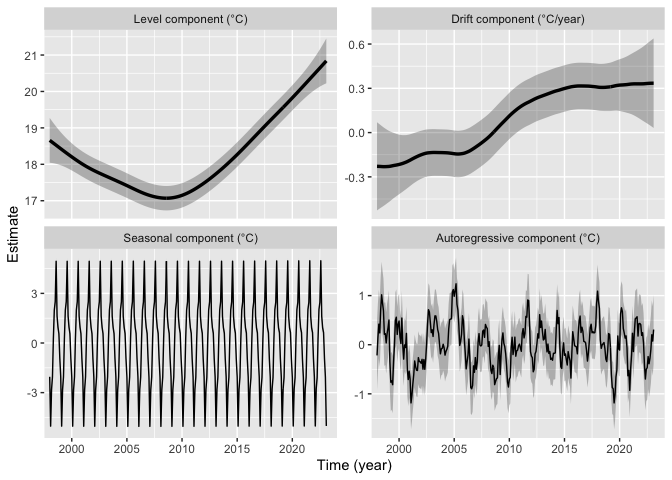
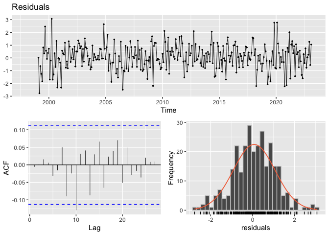
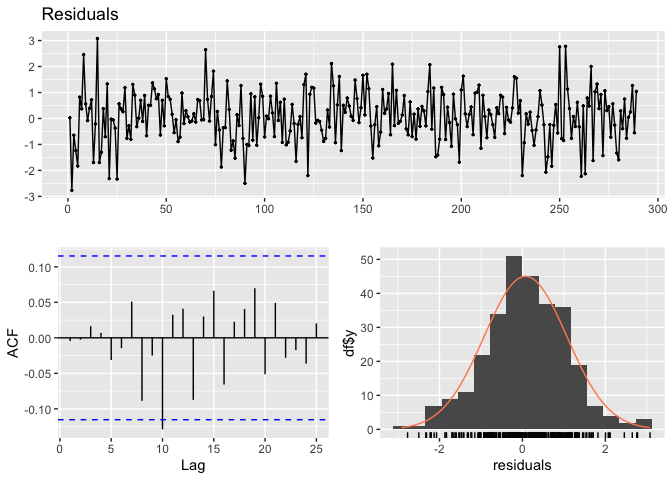
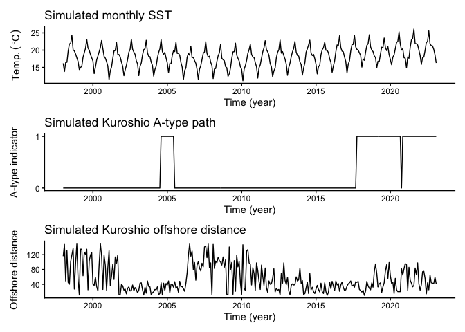
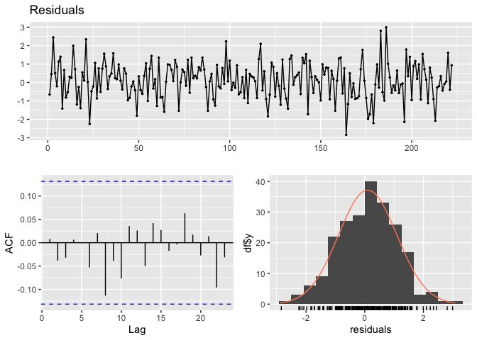
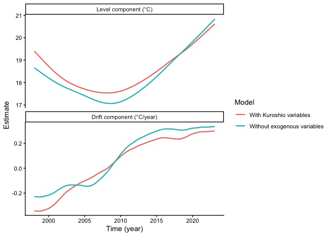
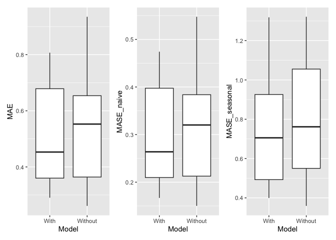
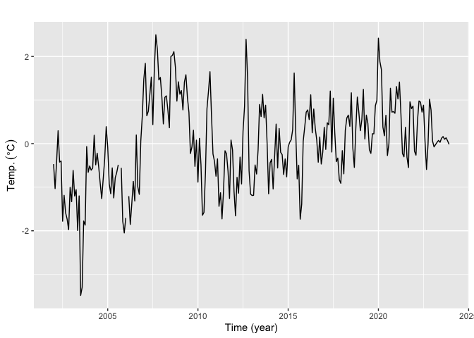
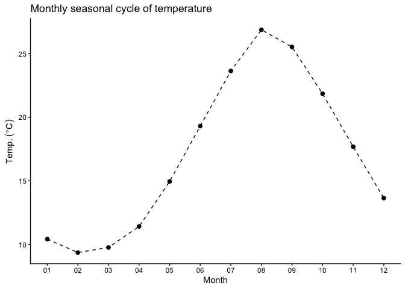

# Summary

`tempssm` is an R package for state-space modeling of environmental
temperature time series, including air and water temperature
observations. It provides a practical framework for assessing how
long-term trend, seasonal variation, autoregressive dependence, and
optional exogenous effects contribute to observed temporal variation.
The package facilitates the application of linear Gaussian state-space
models estimated by Kalman filtering and smoothing, using the `KFAS`
package as the computational backend (Helske, 2017).

# Key Features

- Fits linear Gaussian state-space models to environmental temperature
  time series.
- Represents temperature dynamics using interpretable latent components:
  long-term trend, seasonal variation, autoregressive dependence, and
  optional exogenous effects.
- Supports arbitrary seasonal frequencies, while the current examples
  and validation focus primarily on monthly temperature data.
- Allows users to specify an arbitrary order of the autoregressive
  component (default: AR(1)).
- Includes time-series cross-validation tools for model evaluation.

# Input Data Format

R `ts` objects are the primary input format for `tempssm`. The
temperature series passed to `tempssm()` should be supplied as a
univariate `ts` object, and optional exogenous variables can be supplied
as univariate or multivariate `ts` objects. The `ts` class is base R’s
standard format for regularly spaced time series (see the `stats::ts`
documentation:
<https://search.r-project.org/R/refmans/stats/html/ts.html>). The
package also provides utility functions for converting common tabular
and observational data formats into `ts` objects before model fitting.

The seasonal cycle used by `tempssm()` is taken from the `frequency`
attribute of the input `ts` object. For example, `frequency = 12`
represents monthly data.

# Prior Art and Scope

`tempssm` provides a domain-focused workflow for analyzing temperature
time series with linear Gaussian state-space models. It brings together
model construction, component extraction, uncertainty summaries,
residual diagnostics, visualization, and time-series cross-validation in
a single R package interface tailored to temperature applications.

The package builds on established statistical methodology, including
linear Gaussian state-space modeling, Kalman filtering, and Kalman
smoothing. Model estimation is handled through the `KFAS` package, which
provides a general framework for state-space models in R.

The initial implementation was adapted from the supplementary code
provided by Baba (2024), accompanying Baba et al. (2024), which analyzed
sea temperature trends using a linear Gaussian state-space model. The
supplementary code is publicly available at:

<https://github.com/logics-of-blue/sea-temperature-trend-jogashima>

Compared with that prior implementation, `tempssm` extends the workflow
into a reusable R package interface with input validation, documented S3
methods, tests, diagnostics, cross-validation utilities, and examples
for broader temperature time-series analysis.

# Model Overview

The model implemented in `tempssm` can be viewed as an extension of the
Basic Structural Time Series Model (BSTSM), a standard state-space
formulation that represents an observed time series using latent trend,
seasonal, and irregular components. Following the temperature
time-series application of Baba et al. (2024), `tempssm` keeps this
interpretable decomposition and adds autoregressive dependence and
optional exogenous effects. This makes it useful for separating
long-term temperature change, seasonal cycles, and short-term
departures.

The model is estimated with `KFAS`, and `tempssm()` returns both
filtering and smoothing estimates. Unless otherwise stated, the
summaries, diagnostics, and plots in this vignette use smoothed state
estimates.

The full mathematical specification, including the observation equation,
state decomposition, seasonal constraint, autoregressive component,
exogenous component, parameter count, and estimation procedure, is
described in the separate model specification document, available as a
PDF in the package repository:

<https://github.com/akihirao/tempssm/blob/main/vignettes/model-specification.pdf>

# Tutorial Workflow

This tutorial demonstrates a typical workflow for applying `tempssm` to
monthly environmental temperature time series. Exercise I uses the
simulated sea surface temperature (SST) dataset `sst_sim` to fit a
baseline state-space model without exogenous variables, inspect latent
components, check residual diagnostics, and obtain short-term
predictions. Exercise II extends the same workflow by adding simulated
marine-environment variables and evaluating whether they improve model
interpretation and conditional predictive performance using diagnostics
and time-series cross-validation.

The aim is not to draw new scientific conclusions from the simulated
datasets, but to show how the package can be used to structure model
fitting, diagnostics, prediction, and model comparison workflows.

## Setup

Load the following R packages to run the examples below. If any packages
are not installed, please install them as needed.

``` r
## Set libraries
library(tempssm)
library(forecast)

library(purrr) 
library(tibble)
library(readr)
library(dplyr)
library(ggplot2)

library(patchwork)
```

## Exercise I: Baseline Model for a Univariate Temperature Series

Exercise I introduces the basic workflow for fitting a univariate model,
visualizing latent components, checking residual diagnostics, and making
short-term predictions without exogenous variables.

### Load the Simulated SST Dataset

The package includes `sst_sim`, a simulated monthly sea surface
temperature (SST) dataset.

- **Dataset**: Simulated monthly SST off Jogashima, Japan\
- **Unit**: °C\
- **Period**: January 1998 to February 2023

The dataset was generated from a state-space model analysis of sea
temperature off Jogashima reported by Baba et al. (2024). It is used
here as a reproducible response series for demonstrating the basic
`tempssm` workflow. Exercise II combines the same simulated SST series
with simulated marine-environment variables.

``` r
data(sst_sim) # load a ts object of SST off Jogashima
head(sst_sim)
```

    ##        Jan   Feb   Mar   Apr   May   Jun
    ## 1998 16.19 13.82 16.44 16.49 19.70 21.83

``` r
summary(sst_sim)
```

    ##       Temp      
    ##  Min.   :11.17  
    ##  1st Qu.:16.22  
    ##  Median :18.39  
    ##  Mean   :18.23  
    ##  3rd Qu.:20.11  
    ##  Max.   :26.10

### Plot the Monthly SST Series

We begin by visualizing the monthly SST time series to examine its
overall structure, including apparent trends, seasonal variability, and
the presence or absence of missing observations.

``` r
plt_sst_sim <- forecast::autoplot(sst_sim) +
  labs(y = expression(Temp.~(degree*C)), 
       x = "Time (year)") +
  ggtitle("Monthly SST off Jogashima, Japan") +
  theme_classic()

plot(plt_sst_sim)
```

<!-- -->

The overall mean SST is approximately 18.2 °C, and a clear seasonal
pattern is visible. The series contains 0 missing observations. The raw
time series suggests that SST may have decreased gradually from the
beginning of the record to around 2008 and then increased thereafter.
However, interannual variability is also evident, making the long-term
pattern difficult to assess from the raw series alone.

### Fit the Baseline State-Space Model

When a `ts` object containing temperature time-series data (here,
`sst_sim`) is passed to the core function `tempssm()`, model
construction and parameter estimation are performed together. The
returned S3 object of class `tempssm` (here, `res_ar1`) stores the
filtering and smoothing estimates, as well as the constructed model and
input data. By default, `tempssm()` fits a first-order autoregressive
model.

``` r
# model with first-order autoregressive component
res_ar1 <- tempssm(sst_sim) # (ar_order=1: default)
summary(res_ar1)
```

    ## tempssm summary
    ## -----------------
    ## Call:
    ## tempssm(temp_data = sst_sim)
    ## 
    ## Model fit:
    ##   Likelihood type: marginal 
    ##   Log-likelihood : -198.19 
    ##   k              : 5 
    ##   Diffuse states : 13 
    ##   Converged      : TRUE 
    ## 
    ## Variance parameters:
    ##   Observation (H): 0.07496416 
    ##   State (Q trend): 4.937122e-06 
    ##   State (Q season): 0.0001763538 
    ##   State (Q ar): 0.1202156 
    ## 
    ## Components of auto-regression:
    ##   Order of AR: 1 
    ##   Coefficient of AR1: 0.7579372

From the summary output, confirm that the model has converged
(`Converged: TRUE`). The output also reports the number of parameters
(`k`), the log-likelihood, the likelihood type, and the number of
diffuse initial states.

The parameter estimates correspond to the error variances and
autoregressive coefficients in the fitted state-space model. `H` is the
observation error variance, representing variability in the observed
temperature series that is not explained by the latent states. The `Q`
terms are process error variances for the latent components: `Q trend`
controls stochastic variation in the long-term trend, `Q season`
controls variation in the seasonal component, and the autoregressive
process variance controls variation in the short-term autoregressive
component. The coefficient `AR1` represents first-order autoregressive
dependence in that short-term component.

The log-likelihood and parameter count can also be extracted directly
with `logLik()`.

``` r
ll <- logLik(res_ar1)
ll
```

    ## 'log Lik.' -198.1929 (df=5)

``` r
attr(ll, "df") # number of parameters
```

    ## [1] 5

By default, `tempssm()` uses the KFAS marginal likelihood. The diffuse
likelihood remains available with `marginal = FALSE`, and the selected
likelihood type is retained by `logLik()` and `summary()`.

The package intentionally does not compute AIC for `tempssm` objects
because AIC comparisons for state-space models can require care when
likelihood type, diffuse initialization, or latent-state structure
differs across models. This manual instead emphasizes residual
diagnostics and time-series cross-validation. The log-likelihood and
parameter count remain available for users who need them in their own
workflows.

### Plot Latent Components

The component plot visualizes the estimated long-term level, drift,
seasonal variation, and autoregressive dependence.

``` r
# plot all components at once
plot(res_ar1)
```

<!-- -->

    ## [1] 0.08777084

The long-term trend in the upper-left panel suggests that SST decreased
during the first part of the study period and then increased after
around 2008. In this example, the average annual rate of SST change over
the full period is approximately 0.088 °C.

This full-period average should be interpreted together with the
time-varying drift component. In the upper-right panel, the drift is
negative before around 2008 and becomes positive thereafter,
corresponding to the shift from a decreasing to an increasing long-term
SST pattern. The shaded gray areas show 95% confidence intervals for the
estimated latent states.

For scripted workflows, `plot_tempssm_components()` returns the same
component plot as a `ggplot` object. Individual components can be
selected with the `component` argument.

``` r
# extract individual component plots
plt_level <- plot_tempssm_components(res_ar1, component = c("level"))
plt_drift <- plot_tempssm_components(res_ar1, component = c("drift"))
plt_season <- plot_tempssm_components(res_ar1, component = c("season"))
plt_ar <- plot_tempssm_components(res_ar1, component = c("ar"))
```

### Model Diagnostics

Residual diagnostics help check whether notable structure remains after
model fitting. Here we inspect the residual series, residual
autocorrelation, residual distribution, and a Ljung-Box test.

``` r
r <- get_tempssm_residuals(res_ar1)
lb_lag <- frequency(res_ar1$temp_data)
forecast::checkresiduals(r, lag = lb_lag, test = "LB")
```

<!-- -->

    ## 
    ##  Ljung-Box test
    ## 
    ## data:  Residuals
    ## Q* = 9.6827, df = 12, p-value = 0.6438
    ## 
    ## Model df: 0.   Total lags used: 12

Here, `get_tempssm_residuals()` extracts standardized recursive
residuals, and `forecast::checkresiduals()` displays the residual
series, ACF plot, histogram, and Ljung-Box test. The lag is set to the
seasonal frequency of the input data; for monthly data, this uses lag
12.

In this example, the ACF plot does not show a clear sequence of
successive significant lags or a repeated seasonal pattern. Isolated
spikes can occur when many lags are inspected, so they should be
interpreted together with the Ljung-Box test and the residual
time-series plot rather than used as the sole basis for changing the
model.

For a compact tabular summary of the Ljung-Box test and residual
kurtosis, use `diagnose_residuals()`. The wrapper
`plot_tempssm_residual_diagnostics()` is also available when a single
function call for diagnostic plots is preferred.

``` r
diag <- diagnose_residuals(res_ar1)
print(diag)
```

    ## # A tibble: 1 × 4
    ##   lb_stat lb_lag lb_pvalue kurtosis
    ##     <dbl>  <dbl>     <dbl>    <dbl>
    ## 1    9.68     12     0.644     3.26

The `lb_stat`, `lb_lag`, and `lb_pvalue` columns correspond to the
Ljung-Box test statistic, the lag used in the test, and the P-value. For
monthly time series, the default lag is 12. In this example, the test
does not indicate significant residual autocorrelation up to lag 12.

If residual autocorrelation at longer lags is of concern, the lag can be
specified manually. For example, the following code repeats the
Ljung-Box test up to lags 24 and 36.

``` r
diag_lag24 <- diagnose_residuals(res_ar1, lb_lag = 24)
diag_lag36 <- diagnose_residuals(res_ar1, lb_lag = 36)

diag_lags <- rbind(diag, diag_lag24, diag_lag36)
diag_lags$check <- c("lag 12", "lag 24", "lag 36")
diag_lags[, c("check", "lb_stat", "lb_lag", "lb_pvalue", "kurtosis")]
```

    ## # A tibble: 3 × 5
    ##   check  lb_stat lb_lag lb_pvalue kurtosis
    ##   <chr>    <dbl>  <dbl>     <dbl>    <dbl>
    ## 1 lag 12    9.68     12     0.644     3.26
    ## 2 lag 24   19.5      24     0.725     3.26
    ## 3 lag 36   27.9      36     0.831     3.26

Interpret these tests together with the residual ACF plot. Isolated ACF
spikes can occur by chance, whereas repeated or periodic spikes may
suggest remaining temporal structure.

### Examine the Autoregressive Order

This manual uses the default AR(1) specification as the working model.
The autoregressive component absorbs short-term serial dependence not
represented by the level, drift, and seasonal components. A higher AR
order should be considered when residual diagnostics suggest that
notable autocorrelation remains, rather than treated as an automatic
improvement.

For example, if residual autocorrelation remains after fitting the AR(1)
model, users can fit an AR(2) model and repeat the same diagnostics.

``` r
# Optional sensitivity check with a second-order autoregressive component
res_ar2 <- tempssm(sst_sim, ar_order = 2)
summary(res_ar2)
```

    ## tempssm summary
    ## -----------------
    ## Call:
    ## tempssm(temp_data = sst_sim, ar_order = 2)
    ## 
    ## Model fit:
    ##   Likelihood type: marginal 
    ##   Log-likelihood : -198.19 
    ##   k              : 6 
    ##   Diffuse states : 13 
    ##   Converged      : TRUE 
    ## 
    ## Variance parameters:
    ##   Observation (H): 0.05517452 
    ##   State (Q trend): 4.945287e-06 
    ##   State (Q season): 0.0001859987 
    ##   State (Q ar): 0.149755 
    ## 
    ## Components of auto-regression:
    ##   Order of AR: 2 
    ##   Coefficient of AR1: 0.6553237 
    ##   Coefficient of AR2: 0.07430046

``` r
plot_tempssm_residual_diagnostics(res_ar2)
```

<!-- -->

``` r
diag_lag12_ar2 <- diagnose_residuals(res_ar2, lb_lag = 12)
diag_lag24_ar2 <- diagnose_residuals(res_ar2, lb_lag = 24)
diag_lag36_ar2 <- diagnose_residuals(res_ar2, lb_lag = 36)
diag_lags_ar2 <- rbind(diag_lag12_ar2, diag_lag24_ar2, diag_lag36_ar2)
diag_lags_ar2$check <- c("lag 12", "lag 24", "lag 36")
diag_lags_ar2[, c("check", "lb_stat", "lb_lag", "lb_pvalue", "kurtosis")]
```

    ## # A tibble: 3 × 5
    ##   check  lb_stat lb_lag lb_pvalue kurtosis
    ##   <chr>    <dbl>  <dbl>     <dbl>    <dbl>
    ## 1 lag 12    9.61     12     0.650     3.26
    ## 2 lag 24   19.4      24     0.729     3.26
    ## 3 lag 36   27.9      36     0.831     3.26

In this example, the AR(2) diagnostics are similar to those from the
AR(1) model, so we proceed with AR(1) as the baseline specification.

### Extract Estimated Components

The fitted `tempssm` object contains smoothed state estimates returned
by `KFAS`. The matrix `res_ar1$kfs$alphahat` stores the level, drift,
seasonal states, and autoregressive state.

``` r
# Smoothing estimates
alpha_hat <- res_ar1$kfs$alphahat
head(alpha_hat)
```

    ##             level       slope sea_dummy1 sea_dummy2 sea_dummy3 sea_dummy4
    ## Jan 1998 18.65840 -0.01905354 -2.0428374 -0.9196344  0.5642451  0.9553992
    ## Feb 1998 18.63934 -0.01906722 -5.0256252 -2.0428374 -0.9196344  0.5642451
    ## Mar 1998 18.62028 -0.01909100 -2.8244535 -5.0256252 -2.0428374 -0.9196344
    ## Apr 1998 18.60118 -0.01911003 -2.0508949 -2.8244535 -5.0256252 -2.0428374
    ## May 1998 18.58207 -0.01914415  0.2882283 -2.0508949 -2.8244535 -5.0256252
    ## Jun 1998 18.56293 -0.01918604  1.9925949  0.2882283 -2.0508949 -2.8244535
    ##          sea_dummy5 sea_dummy6 sea_dummy7 sea_dummy8 sea_dummy9 sea_dummy10
    ## Jan 1998  1.6282639  4.9410126  2.4937014  1.9925949  0.2882283  -2.0508949
    ## Feb 1998  0.9553992  1.6282639  4.9410126  2.4937014  1.9925949   0.2882283
    ## Mar 1998  0.5642451  0.9553992  1.6282639  4.9410126  2.4937014   1.9925949
    ## Apr 1998 -0.9196344  0.5642451  0.9553992  1.6282639  4.9410126   2.4937014
    ## May 1998 -2.0428374 -0.9196344  0.5642451  0.9553992  1.6282639   4.9410126
    ## Jun 1998 -5.0256252 -2.0428374 -0.9196344  0.5642451  0.9553992   1.6282639
    ##          sea_dummy11     arima1
    ## Jan 1998  -2.8244535 -0.2178662
    ## Feb 1998  -2.0508949  0.1519895
    ## Mar 1998   0.2882283  0.4187224
    ## Apr 1998   1.9925949  0.2408084
    ## May 1998   2.4937014  0.7185730
    ## Jun 1998   4.9410126  1.0167731

For routine use, helper functions extract individual components as `ts`
objects with the original time index. The level component represents the
estimated long-term temperature level, while the drift component
represents its rate of change per year.

``` r
# Smoothing estimate of level component
level_ts <- get_level_ts(res_ar1)

# Smoothing estimate of drift component
drift_ts <- get_drift_ts(res_ar1)

# Average drift rate per year across the full period
mean_drift_year <- mean(drift_ts) 
print(mean_drift_year)
```

    ## [1] 0.08777084

The average annual rate of SST change was estimated to be 0.0878 °C over
the full period. Because the estimated drift changes sign over time,
this value should be interpreted as a model-based summary of the whole
study period rather than as a constant warming rate.

### Make Short-Term Predictions

A fitted `tempssm` object can also be passed to `predict()` to obtain
short-term predictions. By default, `predict(res)` returns a
one-step-ahead prediction beyond the end of the observed series. This is
useful for visual checks of how the fitted model extrapolates the
estimated level, seasonal, and autoregressive components.

``` r
pred_1 <- predict(res_ar1)
pred_1
```

    ##           Mar
    ## 2023 18.33035

Predictions for multiple future time points can be requested by setting
the `n.ahead` argument.

``` r
pred_12 <- predict(res_ar1, n.ahead = 12)
pred_12
```

    ##           Jan      Feb      Mar      Apr      May      Jun      Jul      Aug
    ## 2023                   18.33035 18.96985 21.33710 23.08522 23.51856 26.03694
    ## 2024 19.09319 16.16926                                                      
    ##           Sep      Oct      Nov      Dec
    ## 2023 22.69098 22.00902 21.74806 20.19190
    ## 2024

Prediction uncertainty can also be returned by setting the `interval`
argument. With `interval = "confidence"`, the returned lower and upper
bounds describe uncertainty in the predicted mean response. With
`interval = "prediction"`, the bounds describe uncertainty in a future
observation and therefore also include observation error; prediction
intervals are usually wider than confidence intervals. The confidence
level is controlled by the `level` argument and defaults to 0.95.

``` r
pred_12_pi <- predict(
  res_ar1,
  n.ahead = 12,
  interval = "prediction",
  level = 0.95
)

pred_12_pi
```

    ##               fit      lwr      upr
    ## Mar 2023 18.33035 17.35029 19.31042
    ## Apr 2023 18.96985 17.85360 20.08610
    ## May 2023 21.33710 20.13453 22.53967
    ## Jun 2023 23.08522 21.82425 24.34619
    ## Jul 2023 23.51856 22.21551 24.82161
    ## Aug 2023 26.03694 24.70183 27.37204
    ## Sep 2023 22.69098 21.33016 24.05179
    ## Oct 2023 22.00902 20.62664 23.39141
    ## Nov 2023 21.74806 20.34682 23.14929
    ## Dec 2023 20.19190 18.77359 21.61020
    ## Jan 2024 19.09319 17.65904 20.52734
    ## Feb 2024 16.16926 14.72135 17.61717

These predictions should be interpreted as model-based extrapolations
rather than definitive forecasts. Uncertainty generally increases as the
prediction horizon becomes longer, and long-horizon predictions can be
sensitive to model assumptions about trend, seasonality, and
autoregressive dependence.

## Exercise II: Model With Exogenous Variables

We extend the state-space modeling framework to examine the effect of
exogenous factors on temperature variation. Specifically, we use
simulated marine-environment variables related to the Kuroshio path as
exogenous variables for the simulated SST series introduced in Exercise
I.

### Load Simulated Marine-Environment Variables

Two simulated exogenous-variable datasets are included in the package.

- **`kuroshio_a_sim`**: monthly binary indicator of the Kuroshio A-type
  path\
- **`distance_sim`**: monthly offshore-distance index of the Kuroshio
  path\
- **Period**: January 1998 to February 2023

Both datasets are provided as univariate `ts` objects with
`frequency = 12`. They are simulated monthly datasets based on the
Kuroshio-related variables used in Baba et al. (2024). The original data
used in that study had finer time resolution for some variables, but the
simulated datasets in this package are represented as monthly time
series for use with `tempssm` examples.

``` r
data(kuroshio_a_sim)
data(distance_sim)

head(kuroshio_a_sim)
```

    ##      Jan Feb Mar Apr May Jun
    ## 1998   0   0   0   0   0   0

``` r
head(distance_sim)
```

    ##      Jan Feb Mar Apr May Jun
    ## 1998 116 148  49 131  45  40

``` r
summary(kuroshio_a_sim)
```

    ##    kuroshio_a    
    ##  Min.   :0.0000  
    ##  1st Qu.:0.0000  
    ##  Median :0.0000  
    ##  Mean   :0.2483  
    ##  3rd Qu.:0.0000  
    ##  Max.   :1.0000

``` r
summary(distance_sim)
```

    ##     distance     
    ##  Min.   : 10.00  
    ##  1st Qu.: 26.00  
    ##  Median : 43.00  
    ##  Mean   : 55.65  
    ##  3rd Qu.: 84.00  
    ##  Max.   :150.00

### Check Time-Series Alignment

For state-space modeling with exogenous variables, the response and
exogenous time series must share a common and aligned time index. In
this example, `sst_sim`, `kuroshio_a_sim`, and `distance_sim` already
have the same monthly time span and frequency.

``` r
series_info <- tibble::tibble(
  series = c("sst_sim", "kuroshio_a_sim", "distance_sim"),
  start = c(
    paste(start(sst_sim), collapse = "-"),
    paste(start(kuroshio_a_sim), collapse = "-"),
    paste(start(distance_sim), collapse = "-")
  ),
  end = c(
    paste(end(sst_sim), collapse = "-"),
    paste(end(kuroshio_a_sim), collapse = "-"),
    paste(end(distance_sim), collapse = "-")
  ),
  frequency = c(
    frequency(sst_sim),
    frequency(kuroshio_a_sim),
    frequency(distance_sim)
  ),
  missing = c(
    sum(is.na(sst_sim)),
    sum(is.na(kuroshio_a_sim)),
    sum(is.na(distance_sim))
  )
)

series_info
```

    ## # A tibble: 3 × 5
    ##   series         start  end    frequency missing
    ##   <chr>          <chr>  <chr>      <dbl>   <int>
    ## 1 sst_sim        1998-1 2023-2        12       0
    ## 2 kuroshio_a_sim 1998-1 2023-2        12       0
    ## 3 distance_sim   1998-1 2023-2        12       0

If user-supplied time series have different start or end points,
`trim_ts_overlap()` can be used to restrict the response and exogenous
series to their shared overlapping period before fitting the model.

### Plot the Response and Exogenous Variables

We visualize the simulated SST series together with the two simulated
Kuroshio variables to inspect the overall structure of the dataset.

``` r
plt_sst_exo <- forecast::autoplot(sst_sim) +
  labs(y = expression(Temp.~(degree*C)), x = "Time (year)") +
  ggtitle("Simulated monthly SST") +
  theme_classic()

plt_kuroshio_a <- forecast::autoplot(kuroshio_a_sim) +
  labs(x = "Time (year)", y = "A-type indicator") +
  ggtitle("Simulated Kuroshio A-type path") +
  scale_y_continuous(breaks = c(0, 1)) +
  theme_classic()

plt_distance <- forecast::autoplot(distance_sim) +
  labs(x = "Time (year)", y = "Offshore distance") +
  ggtitle("Simulated Kuroshio offshore distance") +
  theme_classic()

plt_sst_exo + plt_kuroshio_a + plt_distance +
  patchwork::plot_layout(ncol = 1)
```

<!-- -->

The simulated exogenous variables used here contain no missing values.
When using your own exogenous data, missing values must be handled
before model fitting because `tempssm()` does not allow missing
exogenous values. In contrast, missing values in the dependent
temperature series are allowed and are treated as unobserved responses
during Kalman filtering and smoothing.

### Reuse the Baseline Model

Exercise II uses the same response series as Exercise I, so we reuse the
previously fitted AR(1) model as the reference model without exogenous
variables.

``` r
res_without <- res_ar1
summary(res_without)
```

    ## tempssm summary
    ## -----------------
    ## Call:
    ## tempssm(temp_data = sst_sim)
    ## 
    ## Model fit:
    ##   Likelihood type: marginal 
    ##   Log-likelihood : -198.19 
    ##   k              : 5 
    ##   Diffuse states : 13 
    ##   Converged      : TRUE 
    ## 
    ## Variance parameters:
    ##   Observation (H): 0.07496416 
    ##   State (Q trend): 4.937122e-06 
    ##   State (Q season): 0.0001763538 
    ##   State (Q ar): 0.1202156 
    ## 
    ## Components of auto-regression:
    ##   Order of AR: 1 
    ##   Coefficient of AR1: 0.7579372

This keeps the comparison focused on the additional information
introduced by the simulated Kuroshio variables.

### Combine Exogenous Variables

The `exo_data` argument of `tempssm()` can accept either a univariate
`ts` object or a multivariate `ts` object. Because this exercise uses
two exogenous variables, we combine `kuroshio_a_sim` and `distance_sim`
into a single multivariate `ts` object before fitting the model.

``` r
exo_kuroshio <- cbind(kuroshio_a_sim, distance_sim)
colnames(exo_kuroshio) <- c("kuroshio_a", "distance")

head(exo_kuroshio)
```

    ##          kuroshio_a distance
    ## Jan 1998          0      116
    ## Feb 1998          0      148
    ## Mar 1998          0       49
    ## Apr 1998          0      131
    ## May 1998          0       45
    ## Jun 1998          0       40

``` r
start(exo_kuroshio)
```

    ## [1] 1998    1

``` r
end(exo_kuroshio)
```

    ## [1] 2023    2

``` r
frequency(exo_kuroshio)
```

    ## [1] 12

``` r
colnames(exo_kuroshio)
```

    ## [1] "kuroshio_a" "distance"

``` r
sum(is.na(exo_kuroshio))
```

    ## [1] 0

The resulting object has class `mts`, the multivariate form of base R’s
`ts` class. Each column is treated as a separate exogenous variable, and
the column names are used as labels in summaries and coefficient tables.

### Fit a Model With Exogenous Variables

We next fit a model with the two simulated Kuroshio variables supplied
through `exo_data`.

``` r
res_with <- tempssm(
  temp_data = sst_sim,
  exo_data = exo_kuroshio,
  ar_order = 1
)
summary(res_with)
```

    ## tempssm summary
    ## -----------------
    ## Call:
    ## tempssm(temp_data = sst_sim, exo_data = exo_kuroshio, ar_order = 1)
    ## 
    ## Model fit:
    ##   Likelihood type: marginal 
    ##   Log-likelihood : -154.38 
    ##   k              : 7 
    ##   Diffuse states : 15 
    ##   Converged      : TRUE 
    ## 
    ## Variance parameters:
    ##   Observation (H): 0.003184407 
    ##   State (Q trend): 4.132733e-06 
    ##   State (Q season): 0.0006818023 
    ##   State (Q ar): 0.1556755 
    ## 
    ## Components of auto-regression:
    ##   Order of AR: 1 
    ##   Coefficient of AR1: 0.6585956 
    ## Exogenous variable    kuroshio_a distance 
    ## Estimated coefficient     0.5110124 -0.007070968 
    ## Lower CI  0.1658023 -0.008467629 
    ## Upper CI  0.8562225 -0.005674308

``` r
plot_tempssm_residual_diagnostics(res_with)
```

<!-- -->

``` r
diag_res_with <- diagnose_residuals(res_with)
print(diag_res_with)
```

    ## # A tibble: 1 × 4
    ##   lb_stat lb_lag lb_pvalue kurtosis
    ##     <dbl>  <dbl>     <dbl>    <dbl>
    ## 1    6.50     12     0.889     3.07

The residual diagnostics for this model also do not indicate significant
residual autocorrelation up to lag 12. Thus, AR(1) remains a reasonable
working specification for both models considered here.

We then examine the estimated coefficients for the exogenous variables.

``` r
exo_coef
```

    ##     Variable  Coefficient          lwr          upr
    ## 1 kuroshio_a  0.511012406  0.165802340  0.856222472
    ## 2   distance -0.007070968 -0.008467629 -0.005674308

The coefficient table summarizes the estimated association between SST
and each simulated Kuroshio variable after accounting for the latent
components. In this fitted model, the estimated coefficient for
`kuroshio_a` is 0.51 °C, with a 95% confidence interval from 0.17 to
0.86. Because `kuroshio_a` is coded as a binary indicator, this
coefficient can be read as the estimated SST difference between A-type
and non-A-type conditions, conditional on the other model components and
on `distance`.

The estimated coefficient for `distance` is -0.007 °C per one-unit
increase in the distance index, with a 95% confidence interval from
-0.008 to -0.006. This means that larger values of the simulated
distance index are associated with slightly lower SST, conditional on
the latent components and `kuroshio_a`.

Because these are simulated example datasets, these coefficient
interpretations should be treated as an illustration of how to fit and
inspect a model with multiple exogenous variables, rather than as new
scientific evidence about the Kuroshio path.

For models with exogenous variables, future exogenous values are needed
when calling `predict()`. They can be supplied with `new_exo_data`,
using the same variables and column order as `exo_data`. For a simple
one-step-ahead visual check, `exo_strategy = "last"` carries the final
observed row forward as a persistence assumption.

``` r
pred_with_last_exo <- predict(res_with, exo_strategy = "last")
pred_with_last_exo
```

    ##           Mar
    ## 2023 18.37914

### Compare Estimated Components

We compare the estimated long-term trend and drift between the two
models by overlaying their smoothed point estimates.

``` r
level_without <- get_level_ts(res_without)
level_with <- get_level_ts(res_with)
drift_without <- get_drift_ts(res_without)
drift_with <- get_drift_ts(res_with)

component_compare <- rbind(
  data.frame(
    time = as.numeric(time(level_without)),
    component = "Level component (°C)",
    model = "Without exogenous variables",
    estimate = as.numeric(level_without)
  ),
  data.frame(
    time = as.numeric(time(level_with)),
    component = "Level component (°C)",
    model = "With Kuroshio variables",
    estimate = as.numeric(level_with)
  ),
  data.frame(
    time = as.numeric(time(drift_without)),
    component = "Drift component (°C/year)",
    model = "Without exogenous variables",
    estimate = as.numeric(drift_without)
  ),
  data.frame(
    time = as.numeric(time(drift_with)),
    component = "Drift component (°C/year)",
    model = "With Kuroshio variables",
    estimate = as.numeric(drift_with)
  )
)

component_compare$component <- factor(
  component_compare$component,
  levels = c("Level component (°C)", "Drift component (°C/year)")
)

plt_component_compare <- ggplot(
  component_compare,
  aes(x = time, y = estimate, color = model)
) +
  geom_line(linewidth = 0.8) +
  facet_wrap(~ component, ncol = 1, scales = "free_y") +
  labs(x = "Time (year)", y = "Estimate", color = "Model") +
  theme_classic()

plot(plt_component_compare)
```

<!-- -->

``` r
mean_drift_year_without <- mean(drift_without, na.rm = TRUE)
mean_drift_year_with <- mean(drift_with, na.rm = TRUE)

mean_drift_year_without
```

    ## [1] 0.08777084

``` r
mean_drift_year_with
```

    ## [1] 0.04924515

The level components show a similar broad pattern in both models: SST
declines from the beginning of the record to around 2008 and then
increases toward the end of the period. However, the model with the
simulated Kuroshio variables estimates a higher level during the early
period and a slightly lower level toward the end, compared with the
model without exogenous variables.

The difference between the two models is clearer in the drift component.
The model without exogenous variables shows more local fluctuation in
the rate of change, whereas the model with the simulated Kuroshio
variables gives a smoother transition from negative to positive drift.
This suggests that some short- to medium-term variation represented in
the baseline model’s drift component is instead captured by the
simulated exogenous variables.

The estimated annual rate of SST change over the observation period is
0.0878 in the model without exogenous variables and 0.0492 in the model
with exogenous variables.

This simulated example illustrates that estimated long-term components
can change when external drivers are included.

The next section evaluates whether this difference is also reflected in
out-of-sample predictive performance under a conditional forecasting
setting.

### Evaluate Conditional Predictive Performance With tsCV

Time-series cross-validation (tsCV) evaluates out-of-sample prediction
errors while respecting temporal order. The model is repeatedly fitted
to training windows, and predictions are evaluated on subsequent
observations, avoiding information leakage from the future to the past.

Here, by comparing cross-validation metrics for models with and without
the simulated Kuroshio variables, we assess whether the additional
exogenous information is reflected in out-of-sample predictive
performance.

For the model with the simulated Kuroshio variables, the test-period
values of those variables are supplied to the forecast step as exogenous
variables. Therefore, this tsCV setting evaluates conditional forecasts,
or hindcasts, under the assumption that the Kuroshio-variable values
during each test period are known. This is appropriate when the aim is
to assess the explanatory or reconstructive value of the exogenous
variables.

For real-time future forecasting, however, future exogenous-variable
values are usually unknown. In that setting, users must either provide
future scenarios, forecast the exogenous variables with separate models,
or use a simplified assumption such as carrying the last observed value
forward. The results below should therefore be interpreted as evidence
for improved conditional predictive performance, not as a direct
guarantee of operational forecast improvement.

``` r
## Generate a list of training and test datasets with their indices
# Procedure for constructing year-based time-series cross-validation folds:
# 
# First training data: January 1998-December 2010;
# First test data: January 2011-December 2011
# 
# Second training data: January 1999-December 2011;
# Second test data: January 2012-December 2012
# ...
# 
# Twelfth training data: January 2009-December 2021;
# Twelfth test data: January 2022-December 2022
#
# These folds are automatically generated by the ts_train_test_split() function.
# The final two observations in 2023 are not used because allow_partial = FALSE
# keeps every test set as a complete 12-month period.

# Generate training and test dataset for model without exogenous variables
folds_without <- ts_train_test_split(
  temp_data = sst_sim,
  exo_data = NULL,
  initial = 156, # 156 monthly observations from Jan 1998 to Dec 2010
  horizon = 12, # forecast 12 monthly observations
  step = 12, # move the fixed-width window in one-year steps
  fixed_window = TRUE,
  allow_partial = FALSE
  )

# Generate training and test dataset for model with Kuroshio variables
folds_with <- ts_train_test_split(
  temp_data = sst_sim,
  exo_data = exo_kuroshio,
  initial = 156, # 156 monthly observations from Jan 1998 to Dec 2010
  horizon = 12, # forecast 12 monthly observations
  step = 12, # move the fixed-width window in one-year steps
  fixed_window = TRUE,
  allow_partial = FALSE
  )

# Check the first fold
start(folds_without[[1]]$train_ts)
```

    ## [1] 1998    1

``` r
end(folds_without[[1]]$train_ts)
```

    ## [1] 2010   12

``` r
start(folds_without[[1]]$test_ts)
```

    ## [1] 2011    1

``` r
end(folds_without[[1]]$test_ts)
```

    ## [1] 2011   12

``` r
# *****************************************
# Executing time-series cross validation

#--------------------------------------------------
# Model without exogenous variables

# ts_cv_run() evaluates folds sequentially by default.
 cv_without_results <- ts_cv_run(
   folds_without,
   ar_order = 1,
   use_season = TRUE
 )

# Optional parallel execution:
# Calling library(future) or library(future.apply) is not required here,
# but these suggested packages must be installed.
#cv_without_results <- ts_cv_run(
#  folds_without,
#  ar_order = 1,
#  use_season = TRUE,
#  parallel = TRUE,
#  workers = 2
#)

# Computing assessment indexes
metrics_without <- lapply(cv_without_results, compute_cv_metrics)

# tidy summary
cv_without_tbl <- ts_cv_collect(cv_without_results, metrics_without) %>%
  mutate(Model="Without")


#--------------------------------------------------
# Model with simulated Kuroshio exogenous variables

 cv_with_results <- ts_cv_run(
   folds_with,
   ar_order = 1,
   use_season = TRUE
 )

# Optional parallel execution:
# Calling library(future) or library(future.apply) is not required here,
# but these suggested packages must be installed.
#cv_with_results <- ts_cv_run(
#  folds_with,
#  ar_order = 1,
#  use_season = TRUE,
#  parallel = TRUE,
#  workers = 2
#)

# Computing assessment indexes
metrics_with <- lapply(cv_with_results, compute_cv_metrics)

# tidy summary
cv_with_tbl <- ts_cv_collect(cv_with_results, metrics_with) %>%
  mutate(Model="With")


cv_tbl <- bind_rows(cv_without_tbl, cv_with_tbl)

cv_comparison <- compare_ts_cv(
  list(
    Without = cv_without_tbl,
    With = cv_with_tbl
  )
)

cv_comparison %>% knitr::kable()
```

| model | n_folds | converged_n | converged_rate | mean_MAE | mean_MASE_naive | mean_MASE_seasonal |
|:---|---:|---:|---:|---:|---:|---:|
| Without | 12 | 12 | 1 | 0.5375966 | 0.3137671 | 0.8001065 |
| With | 12 | 12 | 1 | 0.5135379 | 0.2997563 | 0.7705862 |

``` r
plt_MAE <- ggplot(data=cv_tbl,
                  aes(x=Model,y=MAE)) +
  geom_boxplot()

plt_MASE_naive <- ggplot(data=cv_tbl,
                   aes(x=Model,y=MASE_naive)) +
  geom_boxplot()

plt_MASE_seasonal <- ggplot(data=cv_tbl,
                   aes(x=Model,y=MASE_seasonal)) +
  geom_boxplot()


plt_tsCV <- plt_MAE + plt_MASE_naive + plt_MASE_seasonal +
  patchwork::plot_layout(nrow = 1)

plot(plt_tsCV)
```

<!-- -->

The three accuracy metrics summarize prediction errors from
complementary viewpoints. `MAE` is the mean absolute error and is
expressed in degrees Celsius. `MASE` is a unit-free scaled error measure
relative to a simple benchmark computed from the training data. Smaller
values indicate better predictive performance for all three metrics.

In this tutorial, `MASE_naive` uses a non-seasonal naive benchmark based
on one-step changes in the training series. `MASE_seasonal` uses a
seasonal naive benchmark based on changes separated by the seasonal
frequency of the training series; for monthly data, this corresponds to
changes over 12 months. Values below 1 indicate that the model performs
better than the corresponding naive benchmark on average.

The comparison table produced by `compare_ts_cv()` summarizes the number
of folds, convergence rates, and mean prediction-error metrics for each
model. The boxplots show how fold-level errors vary across validation
periods. In this tutorial, tsCV uses 12 annual test periods, providing a
practical basis for comparing the two model specifications within this
example dataset. For formal model assessment, fold design should be
chosen according to the time-series length, prediction horizon, and
intended forecasting task.

The mean MAE of the model with exogenous variables is approximately 0.51
°C. Relative to the seasonal amplitude based on monthly mean SST (about
9.9 °C), this corresponds to roughly 5.2%. Thus, the prediction error is
small compared with the dominant seasonal scale of variation in this
data set, and the model can be considered practically accurate depending
on the intended purpose.

The model with the exogenous variables reduces the mean MAE by
approximately 4.5% compared with the model without exogenous variables.
Similar improvements are also seen in the MASE metrics. This
interpretation should be kept conditional on the tsCV setting used here,
in which the test-period values of the simulated Kuroshio variables are
supplied as exogenous variables.

Together, the coefficient estimates, component comparison, and tsCV
results illustrate how exogenous-variable models can be assessed.
Because the datasets are simulated, the emphasis is on the workflow
rather than on drawing new scientific conclusions about Kuroshio
variability. The same workflow can be extended to other environmental,
climatic, or ecological covariates, while keeping model diagnostics,
predictive performance, and forecasting assumptions explicit.

# Using Your Own Data

## CSV Format

For monthly temperature data stored in a CSV file, prepare columns named
`Year`, `Month`, and `Temp`.

- Year
- Month
- Temp

Example:

``` text
Year,Month,Temp
2010,8,13.6
2010,9,6.8
2010,10,NA
2010,11,-1.4
...
```

- Use NA for missing temperature values, and always keep the
  corresponding Year and Month entries.
- The CSV file must be comma-separated and UTF-8 encoded.

## Convert CSV to a `ts` Object

An example CSV file included in this package is available in
inst/extdata. The example dataset contains monthly air temperature
observations from Mt. Akadake, Hokkaido, Japan (1,840 m). The original
data are available from the Monitoring Sites 1000 Project of the
Ministry of the Environment of Japan (KOZ01.zip,
<https://www.biodic.go.jp/moni1000/findings/data/index.html>).

``` r
path <- system.file("extdata", "example_monthly_temp.csv", package = "tempssm")
akadake_temp <- tempssm::read_monthly_temp_ts(path)
head(akadake_temp)
```

    ##        Jan Feb Mar Apr May Jun Jul   Aug   Sep   Oct   Nov   Dec
    ## 2010                                13.6   6.8   0.2  -6.8 -12.5
    ## 2011 -18.8

The `read_monthly_temp_ts()` function reads this type of CSV file and
converts it into an R `ts` object for use with `tempssm()`. If finer
control is needed, you can also construct a `ts` object manually; see
the `stats::ts` documentation for details:
<https://search.r-project.org/R/refmans/stats/html/ts.html>.

If your data are already stored as an R `ts` object, you can pass them
directly to `tempssm()`.

# References

The statistical modeling framework implemented in `tempssm` is based on
the methodology described in Baba et al. (2024), and the accompanying
supplementary materials and code repository served as the initial source
for development of this package.

Baba, S., Ishii, H., and Yoshiyama, T. (2024). Estimating sea
temperature trends using a linear Gaussian state-space model in
Jogashima, Kanagawa, Japan. *Bulletin of the Japanese Society of
Fisheries Oceanography*, 88(3), 190–199. (In Japanese with an English
abstract.) <https://doi.org/10.34423/jsfo.88.3_190>

Baba, S. (2024). Supplementary code and test data for estimating sea
temperature trends using a linear Gaussian state-space model. GitHub
repository:
<https://github.com/logics-of-blue/sea-temperature-trend-jogashima>

Helske, J. (2017). KFAS: Exponential Family State Space Models in R.
*Journal of Statistical Software*, 78(10), 1–39.
<https://doi.org/10.18637/jss.v078.i10>

# Appendix: Utility Functions

The following utility functions are provided to support data preparation
and exploratory analysis.

## 1. `read_monthly_temp_ts()`

The `read_monthly_temp_ts()` function converts monthly temperature data
stored in a CSV file into an R `ts` object. By enforcing a simple and
consistent data format, it is intended to make externally prepared
time-series data easier to import into tempssm.

### Example

For monthly temperature data, prepare a CSV file with a header row. By
default, the column names must be `Year`, `Month`, and `Temp`, where
`Temp` represents the observed temperature value.

``` text
Year,Month,Temp
2001,1,10.4
2001,2,8.2
2001,3,NA
2001,4,13.6
2001,5,16.1
...
```

- Use NA for missing temperature values, and always keep the
  corresponding Year and Month entries.
- The CSV file must be comma-separated and UTF-8 encoded.

The following example uses the sample CSV file included in the package.
It contains monthly air temperature observations from Mt. Akadake,
Hokkaido, Japan.

``` r
path <- system.file("extdata", "example_monthly_temp.csv", package = "tempssm")

# Read the CSV file and convert it to a monthly ts object
temp_ts <- read_monthly_temp_ts(path)
head(temp_ts)
```

    ##        Jan Feb Mar Apr May Jun Jul   Aug   Sep   Oct   Nov   Dec
    ## 2010                                13.6   6.8   0.2  -6.8 -12.5
    ## 2011 -18.8

## 2. `convert_monthly_df_to_ts()`

The `convert_monthly_df_to_ts()` function converts a data frame
containing monthly temperature data into an R `ts` object. It is
designed to support workflows in which temperature data are first
imported or prepared as a data frame and then used for time-series
analysis.

The input data frame is expected to contain at least two columns: a date
column (`Date`) and a temperature column (`Temp`). For the date column
(`Date`), assign an arbitrary day of the month, such as the first day,
so that the dates correspond to monthly aggregated temperature values.

### Example

``` r
# Create a data frame of monthly temperature data
df <- data.frame(
  Date = as.Date(c(
    "2001-01-01",
    "2001-02-01",
    "2001-03-01",
    "2001-04-01",
    "2001-05-01")
    ),
  Temp = c(10.4, 8.2, NA, 13.6, 16.1)
  )

# Convert to a monthly ts object
temp_ts <- convert_monthly_df_to_ts(df)
head(temp_ts)
```

    ##       Jan  Feb  Mar  Apr  May
    ## 2001 10.4  8.2   NA 13.6 16.1

## 3. `get_jma_sst_ts()`

The `get_jma_sst_ts()` function downloads daily mean sea surface
temperature (SST) data for Japanese coastal waters provided by the Japan
Meteorological Agency (JMA). It aggregates the daily values into monthly
means and returns the resulting time series as an object of class `ts`.

### Example

The following example demonstrates how to download SST data for the
southern coastal waters of Ibaraki Prefecture, Japan.

The argument `sea_area_id` specifies the numeric identifier of a sea
area defined by JMA. For example, `138` corresponds to the coastal
waters off southern Ibaraki. A list of available sea area IDs and their
corresponding regions is provided by JMA at:

<https://www.data.jma.go.jp/kaiyou/data/db/kaikyo/series/engan/eg_areano.html>

``` r
sst_138_ts <- get_jma_sst_ts(sea_area_id = 138)
head(sst_138_ts)
```

    ##           Jan      Feb      Mar      Apr      May      Jun
    ## 1982 15.04419 14.22500 13.63903 15.31933 17.52258 19.52300

## 4. `compute_temp_anomaly()`

The `compute_temp_anomaly()` function computes anomalies from a time
series provided as an R `ts` object. Anomalies are calculated by
subtracting the corresponding long-term mean for each periodic unit,
such as month, from each observation. This transformation is useful for
examining interannual variability after removing periodic effects.

The reference period used to compute anomalies can be specified via a
function argument. By default, the climatology is computed over the
entire available time series (see `?compute_temp_anomaly`).

This transformation is useful for exploratory analysis and modeling
applications that focus on departures from typical seasonal conditions.

### Example

``` r
# Generate temperature anomalies
data(niigata_sst)
niigata_sst_anomaly <- compute_temp_anomaly(niigata_sst)
plt_niigata_sst_anomaly <- forecast::autoplot(niigata_sst_anomaly) +
  labs(y = expression(Temp.~(degree*C)), 
       x = "Time (year)")
plot(plt_niigata_sst_anomaly) 
```

<!-- -->

## 5. `compute_monthly_climatology()`

The `compute_monthly_climatology()` function computes the climatological
mean seasonal cycle from a `ts` object by averaging each seasonal value
across years. It is primarily intended for exploratory analysis and
visualization of seasonal structure in temperature time series.

### Example

``` r
data(niigata_sst)
monthly_seasonal_cycle_niigata_sst <- compute_monthly_climatology(niigata_sst) 
summary(monthly_seasonal_cycle_niigata_sst)
```

    ##      Month        Temperature    
    ##  Min.   : 1.00   Min.   : 9.365  
    ##  1st Qu.: 3.75   1st Qu.:11.169  
    ##  Median : 6.50   Median :16.318  
    ##  Mean   : 6.50   Mean   :17.036  
    ##  3rd Qu.: 9.25   3rd Qu.:22.294  
    ##  Max.   :12.00   Max.   :26.873

``` r
plt_monthly_seasonal_cycle_niigata_sst <- ggplot(
  data = monthly_seasonal_cycle_niigata_sst,
  aes(x = Month, y = Temperature)
) +
  geom_point(size = 2) +
  geom_line(linetype = "dashed") +
  labs(
    title = "Monthly seasonal cycle of temperature",
    x = "Month",
    y = expression(Temp.~(degree*C))
  ) +
  scale_x_continuous(
    breaks = 1:12,
    labels = sprintf("%02d", 1:12)
  ) +
  theme_classic()


plot(plt_monthly_seasonal_cycle_niigata_sst)
```

<!-- -->
