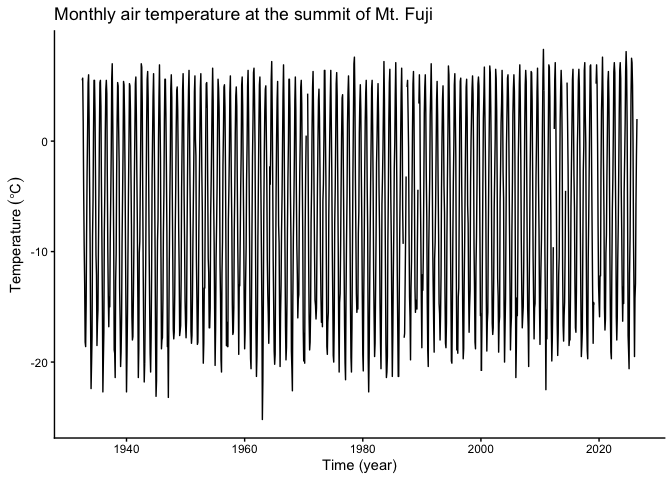
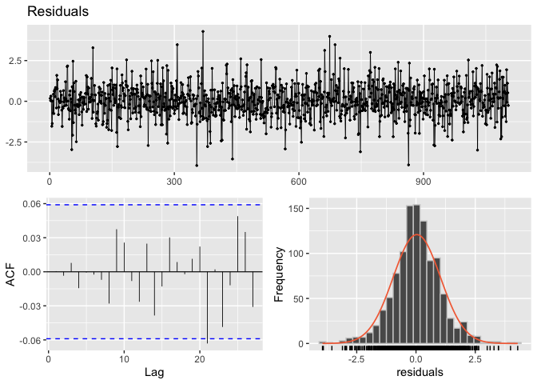

# Summary

`tempssm` is an R package for state-space modeling of environmental
temperature time series, including air and water temperature
observations. It provides a practical framework for assessing how
long-term trend, seasonal variation, autoregressive dependence, and
optional exogenous effects contribute to observed temporal variation.
The package facilitates the application of linear Gaussian state-space
models estimated by Kalman filtering and smoothing, using the `KFAS`
package as the computational backend (Helske, 2017).

# Key Features

- Fits linear Gaussian state-space models to environmental temperature
  time series.
- Represents temperature dynamics using interpretable latent components:
  long-term trend, seasonal variation, autoregressive dependence, and
  optional exogenous effects.
- Supports arbitrary seasonal frequencies, while the current examples
  and validation focus primarily on monthly temperature data.
- Allows users to specify an arbitrary order of the autoregressive
  component (default: AR(1)).
- Includes time-series cross-validation tools for model evaluation.

# Input Data Format

The core modeling functions in `tempssm` expect input time series to be
supplied as R `ts` objects. The `ts` class is base R’s standard format
for regularly spaced time series (see the `stats::ts` documentation:
<https://search.r-project.org/R/refmans/stats/html/ts.html>). The
package also provides utility functions for converting common tabular
and observational data formats into `ts` objects before model fitting.

The seasonal cycle used by `tempssm()` is taken from the `frequency`
attribute of the input `ts` object. For example, `frequency = 12`
represents monthly data.

# Prior Art and Scope

`tempssm` provides a domain-focused workflow for analyzing temperature
time series with linear Gaussian state-space models. It brings together
model construction, component extraction, uncertainty summaries,
residual diagnostics, visualization, and time-series cross-validation in
a single R package interface tailored to temperature applications.

The package builds on established statistical methodology, including
linear Gaussian state-space modeling, Kalman filtering, and Kalman
smoothing. Model estimation is handled through the `KFAS` package, which
provides a general framework for state-space models in R.

The initial implementation was adapted from the supplementary code
provided by Baba (2024), accompanying Baba et al. (2024), which analyzed
sea temperature trends using a linear Gaussian state-space model. The
supplementary code is publicly available at:

<https://github.com/logics-of-blue/sea-temperature-trend-jogashima>

Compared with that prior implementation, `tempssm` extends the workflow
into a reusable R package interface with input validation, documented S3
methods, tests, diagnostics, cross-validation utilities, and examples
for broader temperature time-series analysis.

# Model Overview

The model implemented in `tempssm` can be viewed as an extension of the
Basic Structural Time Series Model (BSTSM), a standard state-space
formulation that represents an observed time series using latent trend,
seasonal, and irregular components. Following the temperature
time-series application of Baba et al. (2024), `tempssm` keeps this
interpretable decomposition and adds autoregressive dependence and
optional exogenous effects. This makes it useful for separating
long-term temperature change, seasonal cycles, and short-term
departures.

The model is estimated with `KFAS`, and `tempssm()` returns both
filtering and smoothing estimates. Unless otherwise stated, the
summaries, diagnostics, and plots in this vignette use smoothed state
estimates.

The full mathematical specification, including the observation equation,
state decomposition, seasonal constraint, autoregressive component,
exogenous component, parameter count, and estimation procedure, is
described in the separate model specification document, available as a
PDF in the package repository:

<https://github.com/akihirao/tempssm/blob/main/vignettes/model-specification.pdf>

# Setup

Load `tempssm` before running the examples below.

``` r
## Set libraries
library(tempssm)
```

The objective of this practice is to demonstrate the basic application
of a linear Gaussian state-space model to a univariate temperature time
series. This example introduces the basic workflow for fitting a
`tempssm` model, inspecting the summary output, plotting latent
components, checking residual diagnostics, and making short-term
predictions.

# Example Dataset

This tutorial uses `temp_MtFuji`, a long-term monthly air temperature
time series observed at the summit of Mt. Fuji, Japan.

- **Dataset**: Monthly mean air temperature at the summit of Mt. Fuji,
  Japan
- **Format**: Univariate `ts` object
- **Frequency**: 12 (monthly)
- **Unit**: Degrees Celsius
- **Period**: July 1932 to June 2026

The dataset was created by processing content from the Japan
Meteorological Agency (JMA), Past Weather Data Download page:
<https://www.data.jma.go.jp/risk/obsdl/index.php>. The series may
contain missing values from the source data; values with JMA quality
flags below 8, where 8 indicates a normal value with no quality problem,
are also treated as missing values.

``` r
data(temp_MtFuji) # load a ts object of temperature at Mt. Fuji
head(temp_MtFuji)
```

    ##        Jul   Aug   Sep   Oct   Nov   Dec
    ## 1932   5.5   5.7   1.8  -4.6  -9.5 -12.9

``` r
summary(temp_MtFuji)
```

    ##    Min. 1st Qu.  Median    Mean 3rd Qu.    Max.     NAs 
    ##  -25.20  -14.60   -5.80   -6.36    2.00    8.30      11

This dataset contains missing observations. `tempssm()` can retain
missing values in the response temperature series and treat them as
unobserved responses during Kalman filtering and smoothing.

# Plot the Time Series

We begin by visualizing the monthly air temperature time series to
examine its overall structure, including apparent trends, seasonal
variability, and whether missing observations are present.

``` r
plt_mtfuji_temp <- forecast::autoplot(temp_MtFuji) +
  ggplot2::labs(
    y = expression(Temperature ~ (degree * C)),
    x = "Time (year)"
  ) +
  ggplot2::ggtitle("Monthly air temperature at the summit of Mt. Fuji") +
  ggplot2::theme_classic()

plot(plt_mtfuji_temp)
```

<!-- -->

The overall mean air temperature is approximately -6.4 °C, and a clear
annual seasonal pattern is visible. The series contains 11 missing
observations. Although the observed temperature appears to increase
gradually over the long term, year-to-year variation and strong
seasonality make the underlying trend difficult to assess from the raw
time series alone.

# Fit a State-Space Model

When a `ts` object containing temperature time-series data (here,
`temp_MtFuji`) is passed to the core function `tempssm()`, model
construction and parameter estimation are performed together. The
returned S3 object of class `tempssm` (here, `res`) stores the filtering
and smoothing estimates, as well as the constructed model and input
data. By default, `tempssm()` fits a first-order autoregressive model.

``` r
# model with first-order autoregressive component
res <- tempssm(temp_MtFuji) # AR(1), the default model
summary(res)
```

    ## tempssm summary
    ## -----------------
    ## Call:
    ## tempssm(temp_data = temp_MtFuji)
    ## 
    ## Model fit:
    ##   Likelihood type: marginal 
    ##   Log-likelihood : -2055.83 
    ##   k              : 5 
    ##   Diffuse states : 13 
    ##   Converged      : TRUE 
    ## 
    ## Variance parameters:
    ##   Observation (H): 0.4919416 
    ##   State (Q trend): 1.146231e-08 
    ##   State (Q season): 4.153786e-24 
    ##   State (Q ar): 1.901346 
    ## 
    ## Components of auto-regression:
    ##   Order of AR: 1 
    ##   Coefficient of AR1: 0.2564485

First, confirm from the summary output that the model has converged
(`Converged: TRUE`). The summary also reports the log-likelihood,
parameter count (`k`), likelihood type, and number of diffuse initial
states. The estimated parameters include the observation error variance
(`H`) and the process error variances for the long-term trend
(`Q trend`), seasonal component (`Q season`), and autoregressive
component (`Q ar`), as well as the autoregressive coefficient (`AR1` in
the default model). See the detailed manual for extracting and using
these quantities directly; its location is listed at the end of this
quick tutorial.

# Plot Model Components

We visualize the estimated long-term evolution of temperature levels and
their rates of change (drift) by extracting the corresponding latent
components from the state-space model. Additionally, seasonal
variability and autoregressive dependence are plotted out, allowing the
underlying trend behavior to be examined more clearly.

``` r
# plot all components at once
plot(res)
```

<!-- -->

The level component summarizes gradual changes in the underlying
temperature level after removing the dominant seasonal pattern. In this
example, the estimated long-term level indicates a gradual increase in
temperature over the study period. The drift component is positive on
average but small relative to the seasonal variation. The seasonal
component captures the recurring annual cycle, while the autoregressive
component represents shorter-term departures from the trend and seasonal
pattern. The shaded gray areas represent 95% confidence intervals for
the estimated latent states, illustrating the uncertainty associated
with each estimated component.

The standard plotting interface is `plot(res)`. The explicit helper
`plot_tempssm_components(res)` produces the same component plot and can
be useful in scripts where a descriptive function name is preferred. The
ggplot2-style S3 interface `ggplot2::autoplot(res)` is also available.
These interfaces return a faceted `ggplot` object, so selected
components can be stored and customized with standard ggplot2 layers,
for example,
`plot_tempssm_components(res, component = c("level", "drift")) + ggplot2::theme_bw()`.

# Check Residual Diagnostics

The package provides diagnostic tools for checking whether the fitted
model has left notable structure in the residuals. In particular,
residual time-series plots, residual autocorrelation, residual
distributions, and Ljung-Box tests can be used to assess remaining
temporal dependence and departures from the Gaussian error assumption.

``` r
r <- get_tempssm_residuals(res)
lb_lag <- frequency(res$temp_data)
forecast::checkresiduals(r, lag = lb_lag, test = "LB")
```

<!-- -->

    ## 
    ##  Ljung-Box test
    ## 
    ## data:  Residuals
    ## Q* = 4.4043, df = 12, p-value = 0.975
    ## 
    ## Model df: 0.   Total lags used: 12

Here, `get_tempssm_residuals()` extracts standardized recursive
residuals, and `forecast::checkresiduals()` displays their time-series
plot, ACF plot, histogram, and Ljung-Box test. The three plots appear in
the upper, lower-left, and lower-right panels, respectively. The lag is
set to the seasonal frequency of the input data; for monthly data, this
uses lag 12. These plots and the test result should be checked for any
notable residual patterns. In this example, the Ljung-Box test indicated
no significant residual autocorrelation up to lag 12 (P \> 0.05).

For tabular residual diagnostic summaries, see `diagnose_residuals()` in
the detailed manual.

For repeated checks across many fitted models, the convenience wrapper
`plot_tempssm_residual_diagnostics(res)` provides the same type of
residual diagnostic plot.

# Extract Components

The fitted object stores the smoothed latent states in
`res$kfs$alphahat`. Each column corresponds to one state component in
the state-space model, such as the level, drift, seasonal states, and
autoregressive state. Looking at the first few rows is useful for
understanding how the model output is organized.

``` r
# Smoothing estimates
alpha_hat <- res$kfs$alphahat
head(alpha_hat)
```

    ##              level        slope sea_dummy1 sea_dummy2 sea_dummy3 sea_dummy4
    ## Jul 1932 -6.816007 0.0005640191  11.386172   7.235620   2.725050  -2.300199
    ## Aug 1932 -6.815443 0.0005640234  12.425581  11.386172   7.235620   2.725050
    ## Sep 1932 -6.814879 0.0005640325   9.370378  12.425581  11.386172   7.235620
    ## Oct 1932 -6.814315 0.0005640435   3.464614   9.370378  12.425581  11.386172
    ## Nov 1932 -6.813751 0.0005640508  -2.878391   3.464614   9.370378  12.425581
    ## Dec 1932 -6.813187 0.0005640535  -9.076789  -2.878391   3.464614   9.370378
    ##          sea_dummy5 sea_dummy6 sea_dummy7 sea_dummy8 sea_dummy9 sea_dummy10
    ## Jul 1932  -8.183394 -11.668060 -12.500582  -9.076789  -2.878391    3.464614
    ## Aug 1932  -2.300199  -8.183394 -11.668060 -12.500582  -9.076789   -2.878391
    ## Sep 1932   2.725050  -2.300199  -8.183394 -11.668060 -12.500582   -9.076789
    ## Oct 1932   7.235620   2.725050  -2.300199  -8.183394 -11.668060  -12.500582
    ## Nov 1932  11.386172   7.235620   2.725050  -2.300199  -8.183394  -11.668060
    ## Dec 1932  12.425581  11.386172   7.235620   2.725050  -2.300199   -8.183394
    ##          sea_dummy11      arima1
    ## Jul 1932    9.370378  0.74270058
    ## Aug 1932    3.464614  0.07576107
    ## Sep 1932   -2.878391 -0.64035913
    ## Oct 1932   -9.076789 -1.00172111
    ## Nov 1932  -12.500582  0.22370694
    ## Dec 1932  -11.668060  2.40713430

For routine use, helper functions provide a simpler way to extract
individual components as `ts` objects with the original time index. The
level component represents the estimated long-term temperature level,
while the drift component represents its rate of change per year.

``` r
# Smoothing estimate of level component
level_ts <- get_level_ts(res)

# Smoothing estimate of drift component
drift_ts <- get_drift_ts(res)

# Average drift rate per year across the full period
mean_drift_year <- mean(drift_ts)
mean_drift_year
```

    ## [1] 0.0183029

Average annual change in air temperature is approximately 0.02 °C. This
value is the mean of the estimated drift component over the full
observation period, and can be read as a model-based summary of the
average long-term rate of temperature change.

# Make Short-Term Predictions

A fitted `tempssm` object can also be passed to `predict()` to obtain
short-term predictions. By default, `predict(res)` returns a
one-step-ahead prediction beyond the end of the observed series. This is
useful for visual checks of how the fitted model extrapolates the
estimated level, seasonal, and autoregressive components.

``` r
pred_1 <- predict(res)
pred_1
```

    ##           Jul
    ## 2026 6.276348

Predictions for multiple future time points can be requested by setting
the `n.ahead` argument.

``` r
pred_12 <- predict(res, n.ahead = 12)
pred_12
```

    ##             Jan        Feb        Mar        Apr        May        Jun
    ## 2026                                                                  
    ## 2027 -17.573776 -16.737527 -13.249136  -7.362216  -2.333243   2.181051
    ##             Jul        Aug        Sep        Oct        Nov        Dec
    ## 2026   6.276348   7.330106   4.281351  -1.619989  -7.959091 -14.153719
    ## 2027

These predictions should be interpreted as model-based extrapolations
rather than definitive forecasts. Uncertainty generally increases as the
prediction horizon becomes longer, and long-horizon predictions can be
sensitive to model assumptions about trend, seasonality, and
autoregressive dependence.

# Read Your Own CSV Data

For monthly temperature data stored in a CSV file, prepare columns named
`Year`, `Month`, and `Temp`. Use `NA` for missing temperature values,
and keep the corresponding `Year` and `Month` entries.

``` text
Year,Month,Temp
2010,8,13.6
2010,9,6.8
2010,10,NA
2010,11,-1.4
...
```

The CSV file should be comma-separated and UTF-8 encoded. The package
includes an example CSV file in `inst/extdata`. The helper function
`read_monthly_temp_ts()` reads this type of CSV file and converts it
into an R `ts` object for use with `tempssm()`.

``` r
path <- system.file(
  "extdata",
  "example_monthly_temp.csv",
  package = "tempssm"
)

csv_temp <- tempssm::read_monthly_temp_ts(path)
head(csv_temp)
```

    ##        Jan Feb Mar Apr May Jun Jul   Aug   Sep   Oct   Nov   Dec
    ## 2010                                13.6   6.8   0.2  -6.8 -12.5
    ## 2011 -18.8

# Further Reading

The examples above illustrate the basic univariate workflow for fitting,
diagnosing, visualizing, and making short-term predictions from a
`tempssm` model. The detailed manual extends this workflow to exogenous
variables, additional model diagnostics, and time-series
cross-validation:

<https://github.com/akihirao/tempssm/blob/main/tools/manual/tempssm_manual.pdf>
